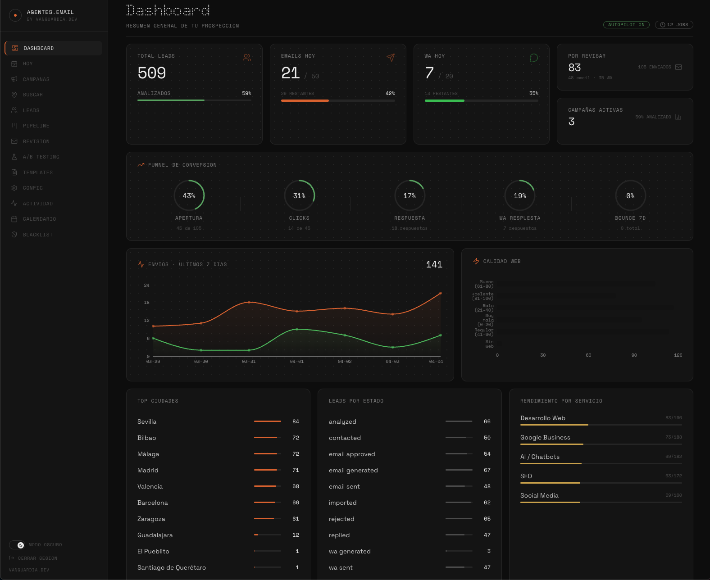

<div align="center">

**English** | [Español](README.es.md)

# ProspectAI

**Open source B2B prospecting engine.**
Find businesses, analyze their websites with AI, and send personalized cold emails and WhatsApp messages — all on autopilot.

[](https://opensource.org/licenses/MIT)
[](https://nextjs.org/)
[](https://www.typescriptlang.org/)
[](CONTRIBUTING.md)

[Live Demo](https://leads.vanguardia.dev) &bull; [Documentation](#quick-start) &bull; [Contributing](CONTRIBUTING.md) &bull; [Roadmap](ROADMAP.md)

<br />

<picture>
  <source media="(prefers-color-scheme: dark)" srcset="public/dashboard-screenshot-dark.png">
  <source media="(prefers-color-scheme: light)" srcset="public/dashboard-screenshot.png">
  
</picture>

</div>

<br />

## Why ProspectAI?

Most B2B outreach tools are expensive SaaS platforms that charge per seat, per lead, or per email. ProspectAI is a **free, self-hosted alternative** that gives you full control over your data and outreach pipeline. No monthly fees, no vendor lock-in — just clone, configure, and start prospecting.

## Features

| | Feature | Description |
|---|---|---|
| :mag: | **Google Maps Scraping** | Search for businesses by keyword + location, import leads automatically |
| :brain: | **AI Website Analysis** | Analyze lead websites with Google Gemini to score quality and find opportunities |
| :envelope: | **Personalized Emails** | AI-generated cold emails tailored to each lead's business |
| :speech_balloon: | **WhatsApp Outreach** | Send personalized WhatsApp messages via whatsapp-web.js |
| :repeat: | **Automated Sequences** | Multi-step follow-up campaigns across email and WhatsApp |
| :bar_chart: | **A/B Testing** | Test subject lines and email variants to optimize open/reply rates |
| :fire: | **Email Warmup** | Gradual sending limit increase to protect domain reputation |
| :kanban: | **Visual Pipeline** | Kanban-style lead pipeline with drag-and-drop |
| :chart_with_upwards_trend: | **Analytics Dashboard** | Real-time metrics: opens, clicks, replies, conversion rates |
| :dart: | **Email Tracking** | Open and click tracking via Resend webhooks |
| :globe_with_meridians: | **16 Languages** | Localized email generation for international prospecting |
| :robot: | **MCP Server** | 25+ tools for managing campaigns via natural language (Claude, etc.) |
| :file_folder: | **CSV/XLSX Import & Export** | Bulk lead management |
| :calendar: | **Campaign Calendar** | Visual calendar view of all scheduled campaigns |

## Tech Stack

| Layer | Technology |
|-------|-----------|
| Frontend | Next.js 16, React 19, TailwindCSS 4 |
| Backend | Next.js API Routes, Node.js |
| Database | SQLite (better-sqlite3) + Drizzle ORM |
| AI | Google Gemini |
| Email | Resend |
| WhatsApp | whatsapp-web.js |
| Scraping | [google-maps-scraper](https://github.com/gosom/google-maps-scraper) (Docker) |

## Quick Start

### Prerequisites

- **Node.js** >= 18
- **Docker** (optional — for Google Maps scraper)
- **Google Gemini API key** — [Get one free](https://aistudio.google.com/apikey)
- **Resend account** — [Sign up](https://resend.com) (free tier: 3,000 emails/month)

### 1. Clone and install

```bash
git clone https://github.com/VanguardiaAI/ProspectAI.git
cd ProspectAI
npm install
```

### 2. Configure environment

```bash
cp .env.example .env.local
```

Edit `.env.local` with your values:

```env
# Required
GEMINI_API_KEY=your_gemini_api_key
RESEND_API_KEY=your_resend_api_key

# Authentication — pick a username and password
AUTH_USERNAME=admin
AUTH_PASSWORD_HASH=          # Generate below
AUTH_SECRET=                 # Generate below

# Optional
RESEND_WEBHOOK_SECRET=       # For email tracking
CRON_SECRET=                 # For automated tasks
```

Generate your auth credentials:

```bash
# Generate password hash (replace 'your-password' with your desired password)
node -e "require('bcryptjs').hash('your-password', 12).then(console.log)"

# Generate auth secret
node -e "console.log(require('crypto').randomBytes(48).toString('base64url'))"

# Generate cron secret (optional)
node -e "console.log(require('crypto').randomBytes(32).toString('hex'))"
```

### 3. Initialize database and run

```bash
# Run database migrations
npm run db:migrate

# Start the development server
npm run dev
```

Open [http://localhost:3000](http://localhost:3000) and log in with your configured credentials.

### 4. Configure your agency (first login)

Go to **Settings** to complete setup:

| Setting | Description |
|---------|------------|
| Agency Name | Your company name (used in generated emails) |
| Agency URL | Your website URL |
| From Email | Sender email (must be verified in Resend) |
| From Name | Sender display name |
| Target Country | Default country for prospecting |
| Daily Send Limit | Maximum emails per day |
| Legal Footer | Compliance text appended to emails |

## Google Maps Scraper

To enable business search via Google Maps:

```bash
# Start the scraper container
docker compose up -d

# Verify it's running (should respond on port 8081)
curl http://localhost:8081
```

Then in **Settings > Google Maps Scraper URL**, set `http://localhost:8081`.

## WhatsApp Integration

WhatsApp uses [whatsapp-web.js](https://github.com/nicochulo2023/whatsapp-web.js) which runs a headless browser session.

1. Go to **Settings > WhatsApp** in the dashboard
2. Scan the QR code with your WhatsApp mobile app
3. The session persists across restarts

> **Note:** Only one WhatsApp session is supported at a time.

## MCP Server

ProspectAI includes a [Model Context Protocol](https://modelcontextprotocol.io) server with 25+ tools for managing campaigns via AI assistants like Claude.

```bash
# Run the MCP server directly
npm run mcp

# Or inspect with the MCP inspector
npm run mcp:inspect
```

Add to your Claude Code or Claude Desktop configuration (`.mcp.json` or `claude_desktop_config.json`):

```json
{
  "mcpServers": {
    "prospect-ai": {
      "command": "npx",
      "args": ["tsx", "src/mcp/index.ts"],
      "cwd": "/path/to/ProspectAI"
    }
  }
}
```

## Cron Jobs

Automated tasks (email sending, sequence progression, warmup, scraping) run via the `/api/cron` endpoint. Set up an external cron to call it:

```bash
# Every 5 minutes
*/5 * * * * curl -s -X POST http://localhost:3000/api/cron \
  -H "Authorization: Bearer YOUR_CRON_SECRET"
```

## Production Deployment

```bash
# Build
npm run build

# Option A: Start with PM2 (recommended)
npx pm2 start ecosystem.config.cjs

# Option B: Start directly
npm start
```

The app runs on port 3000 by default. Use a reverse proxy (nginx, Caddy) for HTTPS in production.

## Project Structure

```
src/
  app/
    (dashboard)/        # 14 dashboard pages (overview, campaigns, leads, pipeline, etc.)
    api/                # 27 API routes
    login/              # Authentication
  components/
    ui/                 # 18 reusable UI components
  db/                   # SQLite schema, migrations, 18 tables
  lib/
    ai/                 # Gemini-powered generation (email, WhatsApp, analysis)
    cron/               # Scheduled job handlers
  mcp/                  # MCP server — 25+ tools across 8 modules
  types/                # TypeScript definitions
data/                   # SQLite database (created at runtime)
docs/                   # Additional documentation
```

## Contributing

Contributions are welcome! See [CONTRIBUTING.md](CONTRIBUTING.md) for guidelines.

## License

[MIT](LICENSE) — free for personal and commercial use.

## Credits

Built by [VanguardIA](https://vanguardia.dev) — AI-powered automation agency.

Visit [leads.vanguardia.dev](https://leads.vanguardia.dev) to learn more about ProspectAI.
